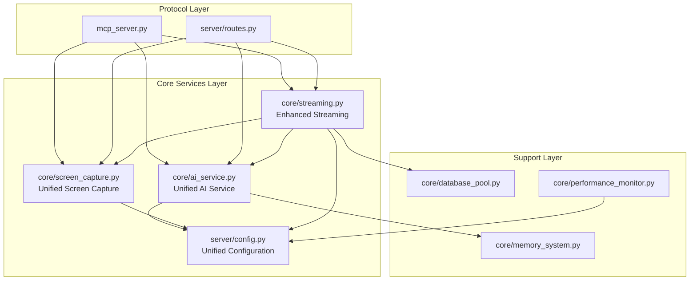

# Design Document

## Overview

Bu tasarım dokümanı, ScreenMonitorMCP v2 projesinin mimari yeniden yapılandırılması için kapsamlı bir plan sunmaktadır. Mevcut kod tabanındaki ciddi kod tekrarı ve mimari tutarsızlıkları ortadan kaldırarak, "Tek Sorumluluk Prensibi"ne (Single Responsibility Principle) uygun, merkezi ve sürdürülebilir bir yapı oluşturacağız.

### Mevcut Durum Analizi

**Kod Tekrarı Problemleri:**
- AI servisleri: `core/ai_service.py`, `core/ai_analyzer.py`, `core/ai_vision.py` arasında benzer işlevsellik
- Ekran yakalama: `core/screen_capture.py` (mss) ve `core/command_handler.py` (PIL.ImageGrab) farklı kütüphaneler kullanıyor
- Konfigürasyon: `core/config.py` ve `server/config.py` iki ayrı sistem

**Mimari Tutarsızlıklar:**
- Protokol katmanları (`mcp_server.py`, `server/routes.py`) iş mantığı içeriyor
- Aynı işlevsellik farklı yollarla implement edilmiş
- Bağımlılık yönetimi tutarsız

## Architecture

### Yeni Merkezi Mimari



### Konsolidasyon Stratejisi

**1. AI Servisleri Birleştirme:**
- `core/ai_service.py` → Tek yetkili AI merkezi
- `core/ai_analyzer.py` → Uzmanlaşmış metotlar olarak taşınacak
- `core/ai_vision.py` → Stream fonksiyonları `core/streaming.py`'ye taşınacak

**2. Ekran Yakalama Merkezileştirme:**
- `core/screen_capture.py` → Tek yetkili ekran yakalama merkezi (mss)
- `core/command_handler.py` → PIL.ImageGrab kullanımı kaldırılacak

**3. Konfigürasyon Tekileştirme:**
- `server/config.py` → Tek yetkili konfigürasyon merkezi (Pydantic)
- `core/config.py` → Silinecek

## Components and Interfaces

### 1. Unified AI Service (core/ai_service.py)

**Mevcut Yapı Korunacak:**
```python
class AIService:
    async def analyze_image(...)
    async def chat_completion(...)
    async def list_models(...)
    # ... mevcut metotlar
```

**Yeni Eklenen Uzmanlaşmış Metotlar:**
```python
class AIService:
    # ai_analyzer.py'den taşınan metotlar
    async def detect_ui_elements(self, image_base64: str) -> Dict[str, Any]
    async def assess_system_performance(self, image_base64: str) -> Dict[str, Any]
    async def detect_anomalies(self, image_base64: str, baseline: str = "") -> Dict[str, Any]
    async def generate_monitoring_report(self, image_base64: str, context: str = "") -> Dict[str, Any]
    async def extract_text(self, image_base64: str) -> Dict[str, Any]
    async def analyze_screen_for_task(self, image_base64: str, task: str) -> Dict[str, Any]
```

**Konfigürasyon Entegrasyonu:**
```python
# Eski: from .config import Config
# Yeni: from ..server.config import config
```

### 2. Enhanced Screen Capture (core/screen_capture.py)

**Mevcut Yapı Korunacak:**
```python
class ScreenCapture:
    async def capture_screen(...)
    async def get_monitors(...)
    def is_available(...)
```

**Yeni Eklenen Metotlar:**
```python
class ScreenCapture:
    # command_handler.py'den taşınan işlevsellik
    async def capture_hq_frame(self, format: str = "png") -> Dict[str, Any]
    async def capture_preview_frame(self, quality: int = 40, resolution: tuple = None) -> Dict[str, Any]
```

### 3. Enhanced Streaming (core/streaming.py)

**Mevcut Yapı Korunacak:**
```python
class StreamManager:
    # ... mevcut metotlar
class ScreenStreamer:
    # ... mevcut metotlar
```

**Yeni Eklenen:**
```python
# ai_vision.py'den taşınan
async def stream_analysis_generator(
    stream_id: str,
    interval_seconds: int = 10,
    prompt: str = "...",
    model: str = None,
    max_tokens: int = 300
) -> AsyncGenerator[Dict[str, Any], None]
```

**Bağımlılık Güncellemeleri:**
```python
# Eski: from .ai_vision import AIVisionAnalyzer
# Yeni: from .ai_service import ai_service
# Eski: from .screen_capture import ScreenCapture (kendi implementasyonu)
# Yeni: from .screen_capture import ScreenCapture (merkezi)
```

### 4. Unified Configuration (server/config.py)

**Mevcut Pydantic Yapısı Korunacak:**
```python
class ServerConfig(BaseSettings):
    # ... mevcut tüm ayarlar
```

**core/config.py'den Taşınan Ayarlar:**
```python
class ServerConfig(BaseSettings):
    # Eklenen ayarlar
    mcp_server_name: str = Field("screenmonitormcp-v2", description="MCP server name")
    mcp_server_version: str = Field("2.0.0", description="MCP server version")
    mcp_protocol_version: str = Field("2025-06-18", description="MCP protocol version")
    default_image_format: str = Field("png", description="Default image format")
    default_image_quality: int = Field(85, description="Default image quality")
```

### 5. Updated Command Handler (core/command_handler.py)

**Ekran Yakalama Refactoring:**
```python
class CommandHandler:
    def __init__(self):
        # Yeni: Merkezi screen capture kullanımı
        self.screen_capture = ScreenCapture()
    
    async def _handle_request_hq_frame(self, ...):
        # Eski: self._capture_hq_frame_sync()
        # Yeni: await self.screen_capture.capture_hq_frame()
    
    async def _stream_preview_frames(self, ...):
        # Eski: self._capture_preview_frame_sync()
        # Yeni: await self.screen_capture.capture_preview_frame()
```

## Data Models

### Configuration Data Model

**Unified Config Structure:**
```python
@dataclass
class UnifiedConfig:
    # Server settings (from server/config.py)
    host: str
    port: int
    workers: int
    
    # AI settings (merged from both configs)
    openai_api_key: Optional[str]
    openai_model: str
    openai_base_url: Optional[str]
    openai_timeout: int
    
    # Screen capture settings (from core/config.py)
    default_image_format: str
    default_image_quality: int
    
    # MCP settings (from core/config.py)
    mcp_server_name: str
    mcp_server_version: str
    mcp_protocol_version: str
    
    # Streaming settings (from server/config.py)
    max_stream_fps: int
    default_stream_fps: int
    max_stream_quality: int
    default_stream_quality: int
```

### Service Interface Models

**AI Service Interface:**
```python
class AIServiceInterface:
    async def analyze_image(self, image_base64: str, prompt: str, **kwargs) -> Dict[str, Any]
    async def chat_completion(self, messages: List[Dict], **kwargs) -> Dict[str, Any]
    # Specialized methods from ai_analyzer.py
    async def detect_ui_elements(self, image_base64: str) -> Dict[str, Any]
    async def assess_system_performance(self, image_base64: str) -> Dict[str, Any]
    # ... other specialized methods
```

**Screen Capture Interface:**
```python
class ScreenCaptureInterface:
    async def capture_screen(self, monitor: int, region: Optional[Dict], format: str) -> bytes
    async def capture_hq_frame(self, format: str) -> Dict[str, Any]
    async def capture_preview_frame(self, quality: int, resolution: tuple) -> Dict[str, Any]
    async def get_monitors(self) -> List[Dict[str, Any]]
```

## Error Handling

### Centralized Error Management

**AI Service Error Handling:**
```python
class AIServiceError(Exception):
    """Base exception for AI service errors"""
    pass

class AIConfigurationError(AIServiceError):
    """AI service configuration errors"""
    pass

class AIAnalysisError(AIServiceError):
    """AI analysis execution errors"""
    pass
```

**Screen Capture Error Handling:**
```python
class ScreenCaptureError(Exception):
    """Base exception for screen capture errors"""
    pass

class MonitorNotFoundError(ScreenCaptureError):
    """Monitor not available error"""
    pass

class CaptureFailedError(ScreenCaptureError):
    """Screen capture execution error"""
    pass
```

**Graceful Degradation Strategy:**
- AI servisi kullanılamıyorsa, ekran yakalama devam etsin
- Ekran yakalama başarısızsa, hata mesajı dönsün ama sistem çökmesin
- Konfigürasyon eksikse, varsayılan değerler kullanılsın

## Testing Strategy

### Unit Testing Approach

**AI Service Tests:**
```python
class TestUnifiedAIService:
    async def test_analyze_image_basic()
    async def test_detect_ui_elements()
    async def test_assess_system_performance()
    async def test_detect_anomalies()
    async def test_configuration_integration()
```

**Screen Capture Tests:**
```python
class TestUnifiedScreenCapture:
    async def test_capture_screen_basic()
    async def test_capture_hq_frame()
    async def test_capture_preview_frame()
    async def test_monitor_detection()
```

**Integration Tests:**
```python
class TestProtocolIntegration:
    async def test_mcp_analyze_screen()
    async def test_api_analyze_screen()
    async def test_same_functionality_both_protocols()
```

### Migration Testing

**Backward Compatibility Tests:**
```python
class TestBackwardCompatibility:
    async def test_existing_mcp_tools_work()
    async def test_existing_api_endpoints_work()
    async def test_streaming_functionality_preserved()
```

**Performance Tests:**
```python
class TestPerformanceImprovements:
    async def test_reduced_memory_usage()
    async def test_faster_screen_capture()
    async def test_consistent_ai_response_times()
```

### Test Data Management

**Mock Data Strategy:**
- AI responses için mock data
- Screen capture için test images
- Configuration için test environments

**Test Environment Setup:**
```python
@pytest.fixture
async def unified_services():
    """Setup unified services for testing"""
    config = TestConfig()
    ai_service = AIService()
    screen_capture = ScreenCapture()
    return config, ai_service, screen_capture
```

## Implementation Phases

### Phase 1: AI Services Consolidation
1. `core/ai_service.py` genişletme
2. `core/ai_analyzer.py` metotlarını taşıma
3. `core/ai_vision.py` stream fonksiyonlarını taşıma
4. Import güncellemeleri
5. Eski dosyaları silme

### Phase 2: Screen Capture Centralization
1. `core/screen_capture.py` genişletme
2. `core/command_handler.py` refactoring
3. PIL.ImageGrab kullanımını kaldırma
4. ThreadPoolExecutor yapısını koruma

### Phase 3: Configuration Unification
1. `server/config.py` genişletme
2. `core/config.py` ayarlarını taşıma
3. Import yollarını güncelleme
4. Eski config dosyasını silme

### Phase 4: Protocol Layer Optimization
1. `mcp_server.py` sadeleştirme
2. `server/routes.py` sadeleştirme
3. İş mantığını core katmanına taşıma
4. Kod tekrarını ortadan kaldırma

### Phase 5: Testing and Validation
1. Unit testler yazma
2. Integration testler yazma
3. Performance testler çalıştırma
4. Backward compatibility doğrulama